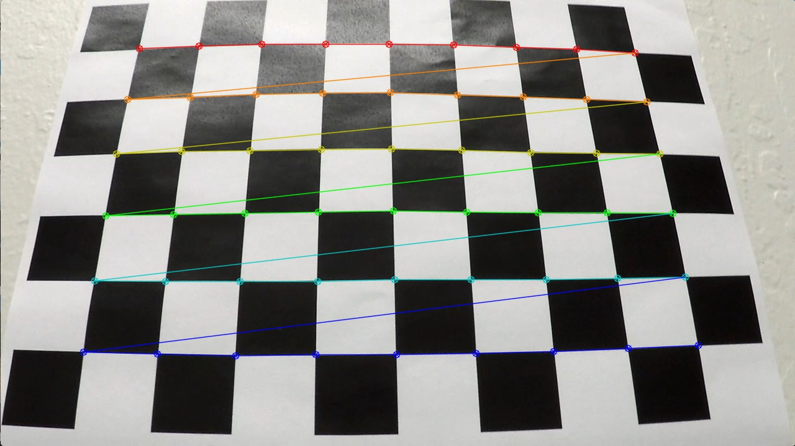
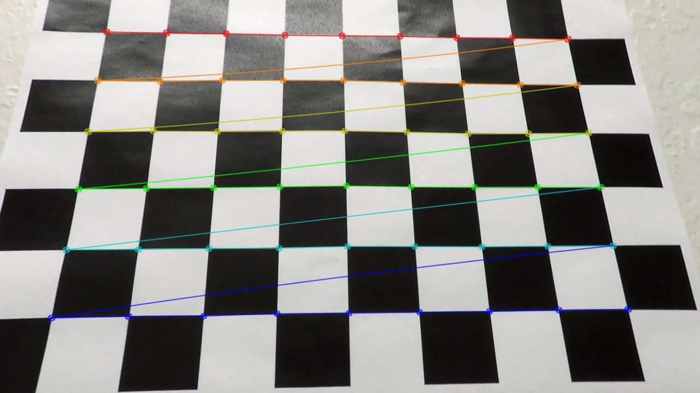
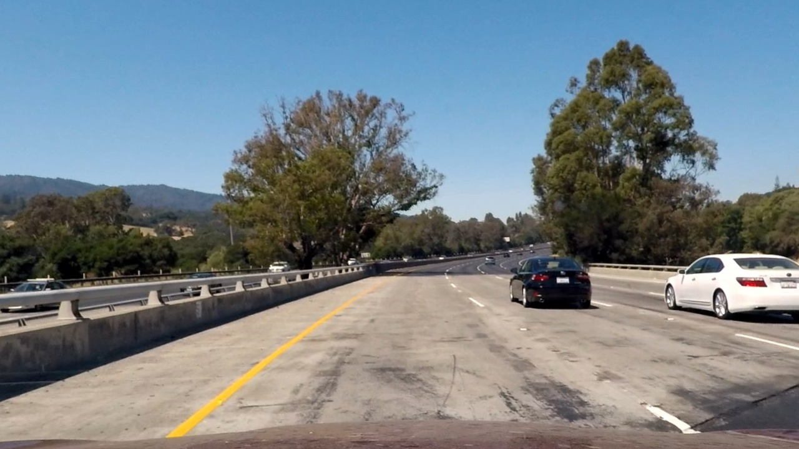
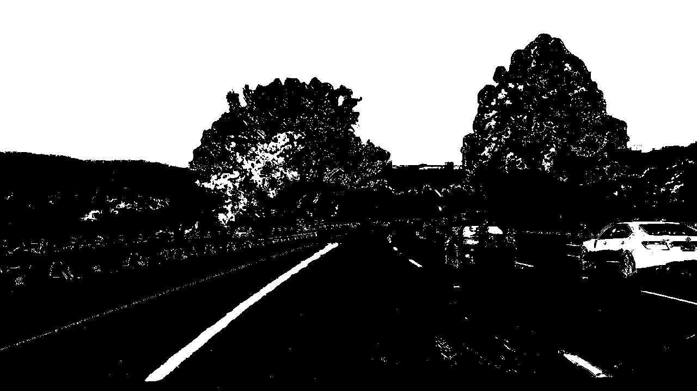
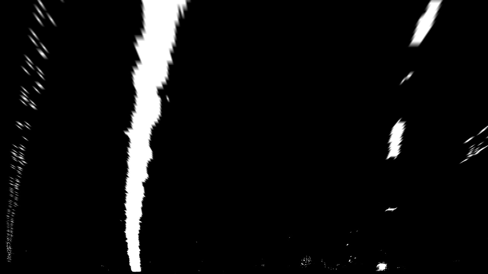
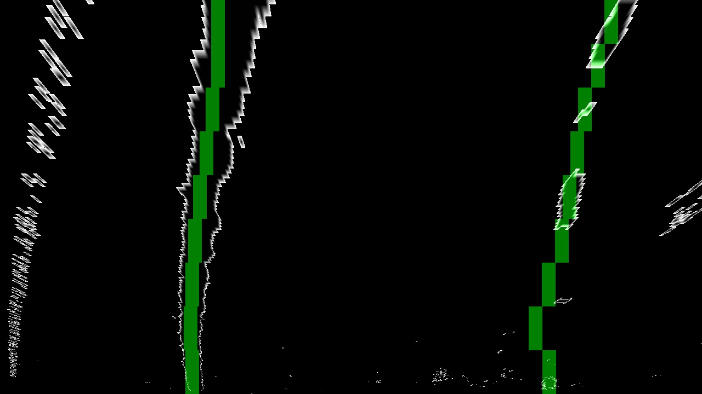

# Advanced-Lane-Line-Detection-and-Tracking
## Self-Driving Car Engineer Nanodegree
***

The objective of this project is to find and track lane lines in real-time. Advanced techniques are employed in order to account for lane curvature and lighting changes. The pipeline process for this project is as follows:
* Camera Clibration
* Distortion Correction
* Color & Gradient Threshold
* Perspective Transform
* Identify Pixels and Fit Polynomial
* Measure Curvature

## Camera Calibration
***

Image distortion is the effect that occurs when a camera maps a 3D object onto 2D space. The transformation from 3D to 2D isnt perfect and consequently requires camera calibration to account for such distortions. The image on the top, shown below, illustrates a distorted image. The image on the bottom shows the result after distortion correction. There is noticeable differences around the endges of the board.

We know what an undostroted, flat chessboard looks like so we use this as a means of undistorting other images. We create a transform to map distorted point (`img_points`) to undistroted points (`obj_points`). Using the `cv2.calibrateCamera` we compute the camera calibration matrix and distortion coefficients and distort any images generated from this particular camera with `cv2.undistort`.

  

## Distortion Correction
***

Within our pipeline, we firstly undistort images based on the results above. Here is an example of image undistortion to the road landscape. The left is the original camera image and the right is undistorted.

  

## Color and Gradient
***

 In order to identify lane lines, the image is processed in the following way which worked best for us. This can all be seen in `image_gen.py` attached.
* __Apply Sobel operators__: Applying these is a way of taking the derivative of an image in the x or y direction. We apply Sobel in x and y directions and identify gradients within the range (30,100). We then create a binary image. This is done using `abs_sobel_thresh`.
* __Color Thresholds__: In the HLS space, we take the s color channel and apply a threshold between (100,255). We also examine the v color channel in the HSV color space and apply a threshold between (50,255). the outcome is a binary image with ones where both s and v thresholds are satisfied. This is done using `color_threshold`. We could have also used other color channles. Further experimentation could optimize our results.
 
Below we see the processed image example. There are a number of different approaches to this. In `image_gen.py` there are other functions that we could have utilised inluding `mag_thresh` and `dir_threshold`. We can also change the hyperparamaters such as the threshold values for more accurate results.

  

## Perspective Transform
***

In this section, we map the processed image points, shown above, to different image points to give a new perspective. This is called perspective transform. We are interested in getting a top down perspective or birds eye view which will enable us to identify lane lines and compute lane curvatures easier. We identify four points on the original image and transform those points onto our destination map. Using both `cv2.getPerspectiveTransform` and `cv2.warpPerspective`, we can create our warped image shown below on the right. Ideally, we want the gap between lanes to be even on the top and bottom of the image. In the right figure below, the distances are relatively similar.

| Source | Destination |
| --- | --- |
| (200,720) | (320,720) |
| (453,547) | (320,590) |
| (835,547) | (960,590) |
| (1100,720) | (960,720) |

  

## Identify Pixels and Fit Polynomial
***

Identifying lane pixels is done in `window_tracker.py`. We apply a convolution method. This invloves the summation of the product pf the window template and the vertical slice of the pixel image. The window is slid from left to right over the image. Overlapping values are summed. The highest overlap of pixels are the most likely position for lane lines. The position results are then appended to `window_centroids`. We continue this process for each level in the range of one to image height divided by window height. There are 9 vertical windows which can be seen in the middle figure below. 

  

## Measuring Curvature
***

The next task is to compute the lane curvature using second degree polynomials for both left and right lanes.

We also compute the vehicle distance from road center. To do this we assumed that the center of the image was the center of the vehicle and that half the distance between the first left and right polynomial points indicate where the vehicle is. The difference between these two demonstrate where the vehicle is in relation to the center of the road. This is illustarted in the immage below.

## Detecting Lane Lines 
***

The [video](https://github.com/Cianrn/Advanced-Lane-Line-Detection-and-Tracking/blob/master/output_images/output2_tracked.mp4) demonstrate our results. Lane lines were successfully detected and tracked. One difficulty occured when a vehicle passed on the right. Evidently, the algorithm picked up on this vehicle as possible lane lines leading to a "flicker". 
